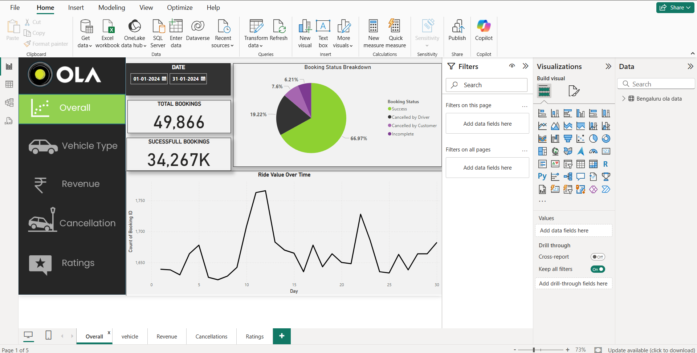
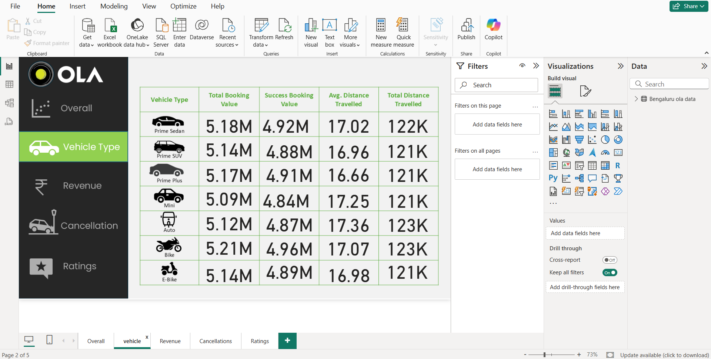
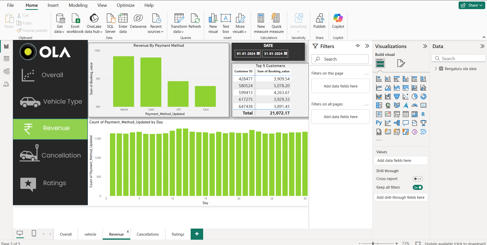
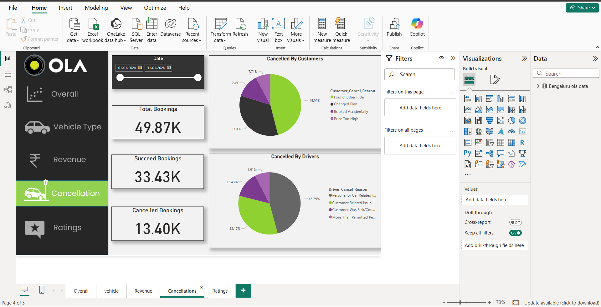
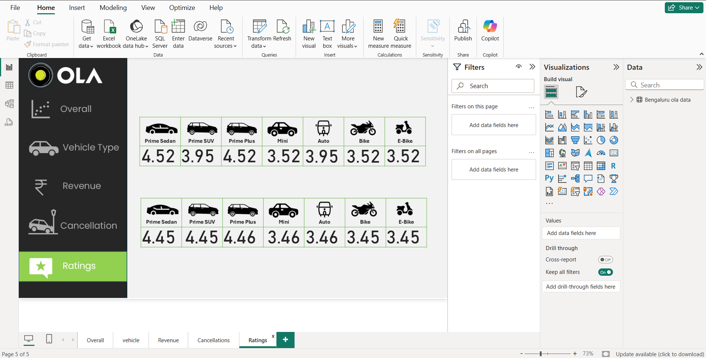

# 🚖 Ola Data Analysis (Bengaluru) – Power BI Project

This Power BI project analyzes Ola ride data from Bengaluru to extract actionable business insights using interactive dashboards.

## 🛠️ Tools Used
- Power BI
- SQL (for initial data cleaning)
- Excel (for preprocessing)
- DAX (Data Analysis Expressions)

---

## 📂 Dataset Overview
- Time Period: Jan 2024
- Fields: Booking status, payment method, vehicle type, ride value, customer ID, driver ID, ratings, etc.

---

## 📊 Dashboards

### 1. Overall Dashboard

### 2. Vehicle Dashboard

### 3. Revenue Dashboard

### 4. Cancellation Dashboard

### 5. Ratings Dashboard

---

## 🔍 Key Insights

- 📊 **Total Bookings**: ~49.78K  
  → ✅ **Successful**: 33.43K  
  → ❌ **Cancelled**: 13.40K

- 🚗 **Vehicle Performance**:
  - **Prime Sedan** and **Prime Plus** show highest success & rating scores.
  - **Mini**, **Auto**, and **Bike** types have lower ratings and more cancellations.

- 💳 **Top Payment Modes**: Wallet and Cash dominate across all zones.

- ⛔ **Customer Cancellations**:
  - 45%: Found another ride  
  - 33.9%: Changed plans  
  - 12.4%: Booked accidentally  
  - 7.71%: Price too high

- 🚫 **Driver Cancellations**:
  - 45.79%: Personal/car issues  
  - 33.17%: Customer-related  
  - 13.43%: Customer was sick  
  - 7.61%: More than permitted

- 🌟 **Ratings Analysis**:

  - 🧑‍💼 **Customer Ratings**:
    - Cars (Prime): ~4.45–4.46 ⭐  
    - Auto/Mini: ~3.46  
    - Bike/eBike: ~3.45  

  - 👨‍✈️ **Driver Ratings**:
    - Prime Sedan & Plus: 4.52  
    - Prime SUV: 3.95  
    - Mini: 3.52  
    - Auto: 3.95  
    - Bike/eBike: 3.52

- 👑 **Top 5 Customers** are major revenue drivers — potential for loyalty rewards.

- 📈 **Weekday Trend**: Highest usage mid-week; dip toward weekends.

---

## 📁 Files Included
- `bengaluru_ola_data.pbix` – Power BI dashboard file
- `ola_data.sql` – SQL script for data transformation
- `Bengaluru ola data.csv` – Original dataset

---

## 📌 How to View
To explore the report:
1. Download the `.pbix` file from this repo.
2. Open it in Power BI Desktop.
3. Use the filters and slicers to interact with the dashboards.

---
